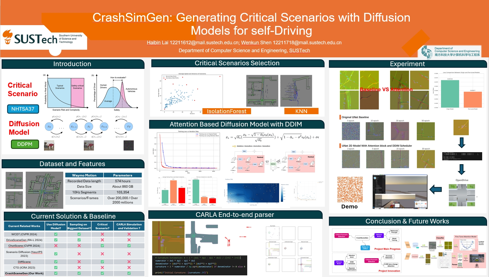

# CrashSimGen

[[Report](https://github.com/HaibinLai/CrashSimGen/blob/main/CrashSimGen__Final_ML_Project%20(9).pdf)]
[[Poster](https://github.com/HaibinLai/CrashSimGen/blob/main/Poster.pdf)]
[[Final PPT](https://github.com/HaibinLai/CrashSimGen/blob/main/ML_DM_No_video.pptx)]
[[Code](https://github.com/HaibinLai/CrashSimGen)]
 [[Project Page](https://haibinlai.github.io/CrashSimGen/)]

[[Proposal](https://github.com/HaibinLai/CrashSimGen/blob/main/CrashSimGen_proposal.pdf)] [[Proposal PPT](https://github.com/HaibinLai/CrashSimGen/blob/main/CrashSceneGen.pdf)]

## CrashSimGen: Generating Safety-Critical Scenarios with Diffusion Models for self-Driving

[[Bilibili Video Demo](https://www.bilibili.com/video/BV1ZPcxeFEP2/?share_source=copy_web&vd_source=72eac555730ba7e7a64f9fa1d7f2b2d4)]

**Haibin Lai, Wenkun shen**

Southern University of Science and Technology

CS329 Machine Learning (H) Course Project (**First Prize, 2nd Place**)

<!--  -->
<!--  -->

https://github.com/user-attachments/assets/b5d47f28-a7f7-45b7-89a1-c30e08b73c1d

## Abstract

CrashSimGen is a project that generates dangerous road scenarios using diffusion models for autonomous driving risk assessment. The project begins by encoding a large set of driving scenes as image data, and training a dangerous scenario recognizer that automatically identifies and labels potentially hazardous situations. These recognized dangerous scene thumbnails are then fed into a diffusion model to generate new dangerous scene thumbnails.

To transform the generated thumbnails into a format usable by autonomous driving systems, we developed a parser that utilizes OpenCV image processing tools to expand the scene thumbnails into OpenDrive formatted driving scenes. These scenes are then imported into the autonomous driving simulation software Carla, where they are tested to assess and improve the vehicle's response to dangerous scenarios in a simulated environment.

## Acknowledgments

This project makes use of the following open-source code:

- [DriveSceneGen](https://github.com/SS47816/DriveSceneGen.git) by SS47816 (Licensed under Apache License 2.0). Website: [DriveSceneGen](https://ss47816.github.io/DriveSceneGen/)

We have integrated this code into our system, and made modifications to suit our needs to run the generative scenes in Carla. See the individual files for the list of changes.
